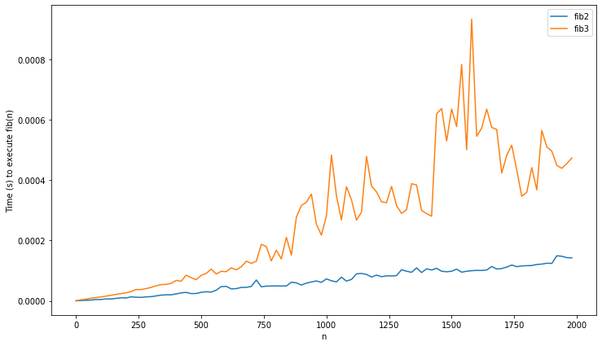
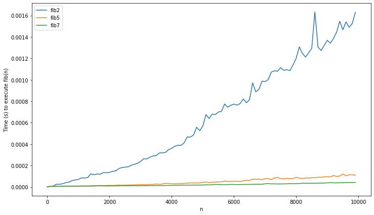
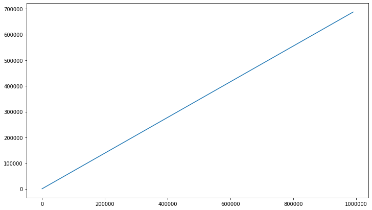

# Calulating Fibonacci, an optimization story

The fibonacci series is so well known, that introducing it almost seems redundant. But for good measure, it is defined as:

$$ F_n = F_{n-1} + F_{n-2} $$

The first the elements of the series are chosen as $F_0 = 0$ and $F_1 = 1$. (other choices are of course possible, e.g. $F_0=2$ and $F_0=1$ is known as the Lucas numbers) The series is important as it occurs frequently in mathematics (and nature). But it also sees some use in computer science (see e.g. the [Fibbonaci heap](https://en.wikipedia.org/wiki/Fibonacci_heap)).

Implementing the fibonacci series seems very simple at first sight. Indeed, it is often the one of the first thing I try out in a new language, right after "Hello world". However, as is often the case in life, an easy problem is no guarantee for an easy solution. I encourage you to take a few minutes to reflect on what the best possible alorithm could be, and what its complexity is, before reading the rest of this article. You may suprised to know that a quick google (at time of writing) will not help you! Wikipedia does not contain the result, and most of the first fora/blogs to pop up have erronous/lacking answers.

Let's start of our search with the most simple algorithm:


```python
def fib1(n):
    if n==0 or n==1:
        return n
    return fib1(n-1) + fib1(n-2)

fib1(10)
```


    55


This solution is very short and readable, but not very efficient. But how inefficient? Recursion often makes it hard to see the exact time complexity. It is easy to see that it should satisfy 
$$T(n) = T(n-1) + T(n-2) + O(1) > 2T(n-1) + O(1) $$
So:
$$T(n) = \Omega(\sum_{i=1}^{n/2} 2^i) = \Omega(2^n) $$ 

So fib1 is at least of exponential complexity. That's bad. (With a little more work, you can show that $T(n) = O(\phi^n)$, where $\phi = \frac{1+\sqrt 5} 2$. So our approximation showed to be fairly close.)

### Linear time
A more sensible approach in python whould be to use an imperative loop instead of recursion. Another way of seeing this, is that we are cleverly applying dynammic programming: the last 2 results are memoised.


```python
def fib2(n):
    if n==0 or n==1:
        return n
    acc1 = 0
    acc2 = 1
    for i in range(n-1):
        acc1, acc2 = acc2, acc1+acc2
    return acc2

fib2(10)
```


    55


Clearly, fib2 is has linear complexity, and is thus much faster than fib1 (except maybe for the smallest of inputs). Functional enthousiast however might dislike this version. It is also possible to achieve this linear complexity while refraining from imperative features, and using accumulators instead.


```python
def fib3(n):
    # Defining auxiliary functions inside the main 
    # function avoids polluting the global namespace.
    def fib_aux(n, acc1, acc2):
        if n==0:
            return acc1
        return fib_aux(n-1,acc2,acc1+acc2)
    
    return fib_aux(n, 0, 1)

fib3(10)
```


    55


Note that this fib3 is very similar to fib2, using recusion instead of looping, and extra parameters instead of local variables. In practice fib3 is much slower than fib2 however. As Python does not have tail-recusion, fib3 creates an extra stack frame each loop. In other words, the memory usage of fib3 will be linear, while fib2 has constant usage. Note that other languages (notably functional languages, like Haskell) do optimize tail recusion well. In such languages fib2 and fib3 will be almost the same when compiled.

### Sublinear time

The fib2, would be the basic version of fibonacci in imperative languages, and fib3 in functional languages. But is it possible to achieve sub-linear performance?

It has been long known that there is a exact formula for the fibonacci sequence. One way to derrive this is using some knowledge on difference equations. (These are the descrete equivalent of differential equations.) This section is fairly math heavy, and can be skipped. We want to solve:

$$ F[n] = F[n-1] + F[n-2] $$
Or, equivalently:
$$ F[n+2] - F[n+1] - F[n+0] = 0 $$


The fibancci equation is linear (meaning every term is of the form $aF[n+b]$ or constant), and homogenous (no constant term). This makes it very easy to solve. A thorough explanation whould lead us to far, but basically one solves this by converting to the characteristic polynomial:
$$ x^2 - x - 1 = 0 $$
This is obtained by substituting $F[n+c]$ by $x^c$. Now, we find the roots:
$$ x = \frac{1 \pm \sqrt 5}{2} $$
One might recognize this as the golden ratio:
$$\phi = \frac{1 + \sqrt 5}{2}$$
So $$x = \phi \text{ or }1-\phi$$

Using this we can find exact solution: 
$$ F[n] = c_1\phi^n + c_2(1-\phi)^n $$
To find the constants $c_1$ and $c_2$, we only need to fill in the initial conditions.

$$ F[0] = 0 = c_1\phi^0 + c_2(1-\phi)^0 $$
$$ \Leftrightarrow c_1 + c_2 = 0  $$
and 
$$ F[1] = 1 = c_1\phi - c_1(1-\phi) $$
$$ \Leftrightarrow 1 = c_1(2 \phi - 1) $$
$$ \Rightarrow c_1 = \frac{1}{\sqrt{5}} = -c_2 $$

This brings us to the solution:

$$ F[n] =  \frac{\phi^n - (1-\phi)^n}{\sqrt{5}}$$

This is also known as Binet's formula (first discovered by the French mathematician Abraham de Moivre).

This should be easy to implement in python:


```python
def sqrt(n): 
    return n**.5
phi = (1 + sqrt(5)) / 2

def fib4(n):
    return (phi**n - (1-phi)**n) / sqrt(5)

fib4(10)
```


    55.000000000000014


Alas, we forgot an important detail. Computers work in finite precision. For large $n$, this rounding error can become very big. As such this method is not usable. Turns out this path was a dead end.

Let's back up and review how the fib3 works. (It is often easier to reason mathematically on functional code, but this is the same for fib2). At each call the function has the parameters (n, $F_n$, $F_{n+1}$). All the auxillary function does is turn (n, $F_n$, $F_{n+1}$) to (n, $F_{n+1}$, $F_n + F_{n+1}$).
We can reframe this to the following matrix notation:

$$
 \begin{pmatrix}
  F[n+2] \\
  F[n+1] \\
 \end{pmatrix}
 =  
  \begin{pmatrix}
  1 & 1 \\
  1 & 0 \\
 \end{pmatrix}
 \cdot
 \begin{pmatrix}
  F[n+1] \\
  F[n] \\
 \end{pmatrix}
$$

This is a sensible thing to do for 2 reasons. First of all, this reframes the problem in a linear algebra background. Consequently we may be able to use prior background knowledge we have in this field. Secondly, this removes the annoying part where the next state relies on the previous 2 states. Here, it is possible to calulate the next term, just using the last vector.

Because of the last fact, it is easy to obtain a direct formula (direct meaning not relying on recursion):
$$
 \begin{pmatrix}
  F[n+1] \\
  F[n] \\
 \end{pmatrix}
 =  
  \begin{pmatrix}
  1 & 1 \\
  1 & 0 \\
 \end{pmatrix}^{n}
 \cdot
 \begin{pmatrix}
  F[1] \\
  F[0] \\
 \end{pmatrix}
$$

When we fill out the initial conditions, you can show that:

$$
  \begin{pmatrix}
  1 & 1 \\
  1 & 0 \\
 \end{pmatrix}^{n}
 =
  \begin{pmatrix}
  F_{n+1} & F_{n} \\
  F_n & F_{n-1} \\
 \end{pmatrix}
$$

So now our problem is reduced to quickly computing:
$$
  \begin{pmatrix}
  1 & 1 \\
  1 & 0 \\
 \end{pmatrix}^{n}
$$

Doing this the naive way, reduces to same algoritm of fib2. If you know some linear algebra, you might suggest using the eigendecomposition, which allows for very fast matrix exponentation. However this leads to the same algorithm as fib4. Indeed, the golden ratio is a eigenvalue of the matrix formulation of this problem. So whilst this is an interesting mathematical observation, this does not help us any further.

A simpler method to speed up exponentiation is by dividing it up. Indeed, if n is even, it holds we can use:
$$ x^{2n} = x^n \cdot x^n $$
instead of the naive:
$$ x^n = x \cdot x^{n-1} $$

Note that this an application of the divide and conquer strategy. What a follows is a simple python implementation of this idea:


```python
# we represent the matrix as a 4-tuple:
X = (1, 1, 1, 0)

# multiplication of matrices
def mult_matrix(A,B):
    (a,b,c,d) = A
    (e,f,g,h) = B
    u = a*e + b*g
    w = a*f + b*h
    x = c*e + d*g
    y = c*f + d*h
    return (u,w,x,y)


def fib5(n):
        
    def fib5b(n):
        if n==0:
            return (1,0,0,1)
        elif n%2==1:
            return mult_matrix(X,fib5b(n-1))
        else:
            A = fib5b(n//2)
            return mult_matrix(A,A)
        
    return fib5b(n)[1]
    
fib5(10)
```


    55


We can further shave of some computations by extracting exact formulas from the matrix algorithm.
Start by using the halving trick:

$$
  \begin{pmatrix}
  1 & 1 \\
  1 & 0 \\
 \end{pmatrix}^{2n}
 =
  \left(\begin{pmatrix}
  1 & 1 \\
  1 & 0 \\
 \end{pmatrix}^n\right)^2
$$

$$
  \begin{pmatrix}
  F_{2n+1} & F_{2n} \\
  F_{2n} & F_{2n-1} \\
 \end{pmatrix}
 =
  \begin{pmatrix}
  F_{n+1} & F_n \\
  F_n & F_{n-1} \\
 \end{pmatrix}^2
$$

$$
  \begin{pmatrix}
  F_{2n+1} & F_{2n} \\
  F_{2n} & F_{2n-1} \\
 \end{pmatrix}
 =
  \begin{pmatrix}
  F_{n+1}^2 + F_n^2 & F_n (F_{n-1} + F_{n+1}) \\
  F_n (F_{n-1} + F_{n+1}) & F_{n}^2 + F_{n-1}^2 \\
 \end{pmatrix}
$$

Now we can extract the formulas for the even and odd part:
$$ F_{2n} = F_n (F_{n-1} + F_{n+1}) = F_n (2F_{n+1} - F_n) $$
$$ F_{2n+1} = F_{n+1}^2 + F_n^2 $$


```python
def fib6(n):
    
    def fib_aux(n):
        if n == 0:
            return (0, 1)
        else:
            a, b = fib_aux(n//2)
            c = a * (2*b - a)
            d = a*a + b*b
            if n%2 == 0:
                return (c, d)
            else:
                # in the odd case, add a single fib iteration
                return (d, c + d)
            
    return fib_aux(n)[0]

fib6(10)
```


    55


The time complexity of the above function is defined by the recurence relation $T(n) = T(n/2) + O(1)$. By the master theorem, this implies a time complexity of $O(log(n))$. Finally, a significant improvement on fib2!

The above algorithm is a simplified version of what is used in actual high-performance code, such as GMP. Altough they apply a little further optimisation. For example, the above version uses 3 multiplication in each call, but it is possible to use only 2. (Note that the 2*b is not counted as a multiplication, as it is trivial to do in pratice with a bit shift).

It's already know that:

$$ F_{2n} = F_n (F_{n-1} + F_{n+1}) = F_n (2F_{n-1} + F_n) $$
$$ F_{2n-1} = F_{n-1}^2 + F_n^2 $$

Using this we can expand:

$$ F_{2n+1} = F_{2n} + F_{2n-1} $$
$$ F_{2n+1} = 2F_nF_{n-1} + F_n^2 + F_{n-1}^2 + F_n^2   $$
$$ F_{2n+1} = 2F_n^2 + F_{n-1}^2 + 2F_nF_{n-1} $$
$$ F_{2n+1} = 4F_n^2 - F_{n-1}^2 - 2F_n^2 + 2F_{n-1}^2 + 2F_nF_{n-1} $$

Let's take a look at that last part:
$$ k_n = - F_n^2 + F_{n-1}^2 + F_nF_{n-1}  $$
$$ k_n = - (F_{n-1} + F_{n-2})^2 + F_{n-1}^2 + (F_{n-1} + F_{n-2})F_{n-1} $$
$$ k_n = - k_{n-1}  $$

From this, it follows that $k_n$ is $-1$ or $1$, depending on if n is even or odd. So $k_n = (-1)^n$. Now we can piece all the puzzles together:
$$ F_{2n-1} = F_n^2 + F_{n-1}^2 $$
$$ F_{2n+1} = 4F_n^2 - F_{n-1}^2 + 2 (-1)^n $$
$$ F_{2n} = F_{2n+1} - F_{2n-1} $$

Clearly this above relations cost only two squares, an improvement on the previous 3 multiplications. There is the cost of an extra addition, but these are faster than multiplication/squares. (More about this later.)


### Evaluating

Thus far was all theory. Let's plot some graphs to see if it actually worked:


```python
import matplotlib.pyplot as plt
plt.rcParams['figure.figsize'] = [12, 7]
import numpy as np
from timeit import timeit

def timer(q, n, N=50):
    f = globals()["fib"+str(q)]
    return timeit(lambda: f(n), number=N)/N

def plot_range(q, xx, N=50):
    yy = [timer(q,n) for n in xx]
    plt.plot(xx, yy)
    
```

Let's start off with the first three implementations, remember that fib1 was the naive implementation with exponential time complexity, while fib2 and fib3 had linear complexity.


```python
xx = range(0,28,1)
plot_range(1,xx)
plot_range(2,xx)
plot_range(3,xx)
plt.legend(["fib1", "fib2", "fib3"])
plt.xlabel("n")
plt.ylabel("Time (s) to execute fib(n)")
```


    Text(0, 0.5, 'Time (s) to execute fib(n)')


As to be expected, fib1's runtime explodes around 20, while the other 2 remain virtually constant.
Let's compare fib2 and fib3 on some larger integers:


```python
xx = range(0,2000,20)
plot_range(2,xx, N=1000)
plot_range(3,xx, N=1000)
plt.legend(["fib2", "fib3"])
plt.xlabel("n")
plt.ylabel("Time (s) to execute fib(n)")
```


    Text(0, 0.5, 'Time (s) to execute fib(n)')





As to be expected, the imperative implementation is considerably faster. The behaviour from fib3 is also much more irregular, which could be explained by it's linear memory usage, giving raise to lots of memory allocations and deallocations. It's also worth nothing that fib3 would not work on input larger than 2000, as python has a maximum recursion depth. Now let's see if the added complexity of fib5 and fib7 are worth it:


```python
xx = range(0,10000,100)
plot_range(2,xx, N=200)
plot_range(5,xx, N=200)
plot_range(6,xx, N=200)
plt.legend(["fib2", "fib5", "fib7"])
plt.xlabel("n")
plt.ylabel("Time (s) to execute fib(n)")
```


    Text(0, 0.5, 'Time (s) to execute fib(n)')





Indeed, fib2 is cleary much slower. Let's view fib5 and fib7 on larger data, so we can compare them better:


```python
xx = range(0,100000,1000)
plot_range(5,xx, N=100)
plot_range(6,xx, N=100)
plt.legend(["fib5", "fib7"])
plt.xlabel("n")
plt.ylabel("Time (s) to execute fib(n)")
```


    Text(0, 0.5, 'Time (s) to execute fib(n)')


Wait, didn't I say that fib5/7 had logarithmic complexities? These do no look logarithms at all, they appear to be superlinear! What's going on?

### Digging deeper

The flaw in our previous analysis, is the implicit assumption that addition and multiplication are $O(1)$. This is case for 32-bit integers, as the operations are implemented in hardware. But unlike Java or C, which use these i32 integers, python uses arbitrary size integers. This is obviously needed to avoid overflows ($F_{50}$ is enough to overflow in i32), but also costly: addition and multiplication no longer have constant time usage.

Addition for big integers is straightforward (it's not unlike the grade school method). As such the complexity is linear in the amount of digits, so $O(log(n))$. Multiplication fares worse, the algorithm is quadratic in the number of digits $O(log(n)^2)$.

Look at the last multiplication needed in fib7: $F_{n/2} \cdot F_{n/2}$ . This will have a time complexity of: $O(log(F_{n/2})^2) = O(log(\phi^{n/2})^2) = O(n^2) $. This is far greater than the constant time assumed! By applying the master's theorem again, the complexity using naive multiplication really is $O(n^2)$ instead of the assumed $O(log(n))$.

It was long assumed that $O(n^2)$ is the best possible algorithm for multiplication. Famously, the young Karatsuba didn't believe his professor (another famous computer scientist: Kolmogorov) who proclaimed this in a lecture. The result is the Karatsuba algorithm, which has complexity $O(n^{lg(3)}) \approx O(n^{1,58})$, a considerable improvement. Further research has resulted in several algorithms who decreased this further still. (Altough the ever increasing constant factors have limited practical usability). Some may find it supprising to hear, that multiplying 2 numbers is still an open research question. Just last year, a new algorithm was proposed by french mathematicians, that obtained the elusive limit of $O(n \cdot log(n))$. It has been long conjectured that this would be the best possible complexity, but no proof has been found yet.

Python is smart enough not to use the naive multiplication. In case of large integers, it uses the Karatsuba algorithm. So fib6 has time complexity $O(n^{1,58})$, which is finally the correct answer! Now we also know what the optimal complexity is for fibonacci: $O(n \cdot log(n))$.

We also have to take in account the memory usage. Memory complexity is $O(log(F_n)) = O(log(\phi^n)) = O(n)$. We can easily check this fact experimentally:


```python
xx = range(0,1000000,10000)
yy = [len(bin(fib7(x))) for x in xx]
plt.plot(xx, yy)
```


    [<matplotlib.lines.Line2D at 0x7f6e58460048>]





Seems linear indeed!

### Finishing off


