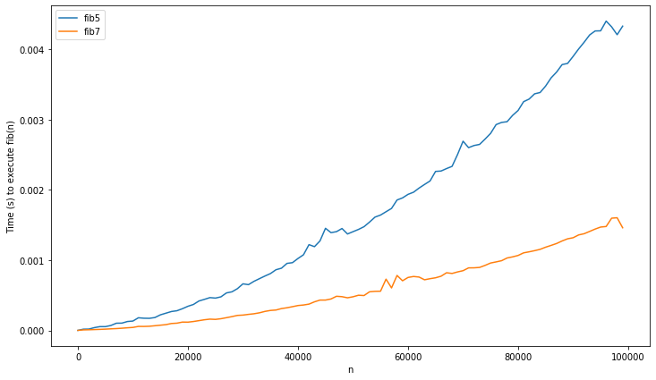

The Fibonacci series is so well-known, that introducing it seems almost redundant. But for good measure, it's the series based on the recurrence relation:


$$F_n = F_{n-1} + F_{n-2}$$


With initial elements $F_0 = 0$ and $F_1 = 1$.[^Lucas]
Implementing the Fibonacci function seems very simple. It's usually the second thing I try out when learning new language, right after `"Hello world!"`. But this is a deeper problem than it appears to be on the surface. In the rest of this post, I'll showcase different algorithms for calculating Fibonacci numbers, in search of the algorithm with optimal complexity. 

I encourage you to reflect on your own on what this (asymptotically) fastest algorithm could be, before reading the rest of this article. You may be surprised to find that a quick google (at time of writing) might not help you! Wikipedia does not contain the result, and almost all of the fora/blogs to pop up on the first google page have erroneous/lacking answers.

# Naive solution

Let's start our quest with the most basic algorithm. In Python, we can immediatly implement the recurrence as:


```python
def fib1(n):
    if n==0 or n==1:
        return n
    return fib1(n-1) + fib1(n-2)
```

This solution is very elegant, but not very efficient. How inefficient you say? Well, recursion often makes it hard to see the exact time complexity. What you can see, is the recurrence relation:

$$T(n) = T(n-1) + T(n-2) + O(1) $$

Notice how this is almost the same recurrence relation as the Fibonacci series itself! With bit of work, you can confirm this intuition by showing that $T(n) = O(F_n)$. As will be discussed later, Fibonacci is roughly exponential (to be exact, it's of $O(F_n) = O(\phi ^ n)$), confirming that this is a pretty horrible implementation speed-wise.

# Linear time
A more sensible approach would be to use an imperative loop instead of recursion.

```python
def fib2(n):
    acc1 = 0
    acc2 = 1
    for i in range(n):
        acc1, acc2 = acc2, acc1+acc2
    return acc1
```

Another way of seeing this is that we are applying dynamic programming: the last 2 results are memorized.

You can also get the same effect by staying functional and using extra parameters instead of extra variables.


```python
def fib3(n):
    def fib_aux(n, acc1, acc2):
        if n==0:
            return acc1
        return fib_aux(n-1,acc2,acc1+acc2)
    
    return fib_aux(n, 0, 1)
```

It should be clear that both `fib2` and `fib3` are of linear time complexity, a great improvement on `fib1`. In practice `fib3` will be slower than `fib2`. As Python does not have tail-recursion, `fib3` creates an extra stack frame each loop. In other words, the memory usage of `fib3` will be linear, while `fib2` has constant memory usage. Note that other (functional) languages do optimize tail-call recursion. In these languages `fib2` and `fib3` should behave practically the same.

# Sublinear time

While the implementation above probably suffices for most practical purposes, the question remains if we can do better.

It has long been known that there is a direct formula for the Fibonacci sequence:

$$ F_n =  \frac{\phi^n - (1-\phi)^n}{\sqrt{5}}$$

Where $\phi$ is [the golden ratio](https://en.wikipedia.org/wiki/Golden_ratio "Wikipedia"). This is known as Binet's formula [^Binet]. How to derive this isn't super relevant here, but it's discussed briefly in [the appendix](#derivation) if you're interested.

This should be easy to implement in Python:


```python
def sqrt(n): 
    return n**.5
phi = (1 + sqrt(5)) / 2

def fib4(n):
    return (phi**n - (1-phi)**n) / sqrt(5)
```


Alas, we forgot an important detail. Computers work in finite precision. For large $n$, the rounding errors can become very big. This means `fib4` is only usable to get an approximation of the result, which is not what we're interested in. There are ways to fix this ([see appendix](#calculation)), but their performance is usually not great either. Seems like we'll need to try out something else...

Let's back up and review how the `fib3` works. At each call, the function has the parameters (n, $F_n$, $F_{n+1}$). All the auxiliary function does is turn (n, $F_n$, $F_{n+1}$) to (n, $F_{n+1}$, $F_n + F_{n+1}$).
We can reframe this to the following matrix notation:

$$
 \begin{pmatrix}
  F_{n+2} \\
  F_{n+1} \\
 \end{pmatrix}
 =  
  \begin{pmatrix}
  1 & 1 \\
  1 & 0 \\
 \end{pmatrix}
 \cdot
 \begin{pmatrix}
  F_{n+1} \\
  F_{n} \\
 \end{pmatrix}
$$

This is a sensible thing to do for 2 reasons. First of all, by framing the problem in a linear algebra background, we may be able to use prior background knowledge we have in this field. Secondly, this removes the annoying part where the next state relies on the previous 2 states. Here, it is possible to calculate the next term, just using the last vector.

Because of this last fact, it is easy to obtain a closed formula:

$$
 \begin{pmatrix}
  F_{n+1} \\
  F_{n} \\
 \end{pmatrix}
 =  
  \begin{pmatrix}
  1 & 1 \\
  1 & 0 \\
 \end{pmatrix}^{n}
 \cdot
 \begin{pmatrix}
  F_{1} \\
  F_{0} \\
 \end{pmatrix}
$$

After filling in the initial conditions, you can show that:

$$
  \begin{pmatrix}
  1 & 1 \\
  1 & 0 \\
 \end{pmatrix}^{n}
 =
  \begin{pmatrix}
  F_{n+1} & F_{n} \\
  F_n & F_{n-1} \\
 \end{pmatrix}
$$

So now our problem is reduced to quickly computing
$\begin{pmatrix}
  1 & 1 \\
  1 & 0 \\
 \end{pmatrix}^{n}$.

Doing this the naive way reduces to the same algorithm of `fib2`. But you can speed up exponentiation by taking advantage of the fact that $x^{2n} = x^n \cdot x^n$
instead of using the naive
$x^{n+1} = x \cdot x^n$.

Note that this is an application of the divide and conquer strategy. What follows is a simple Python implementation of this idea:


```python
# we represent the matrix as a 4-tuple:
X = (1, 1, 1, 0)

# multiplication of matrices
def mult_matrix(A,B):
    (a,b,c,d) = A
    (e,f,g,h) = B
    u = a*e + b*g
    w = a*f + b*h
    x = c*e + d*g
    y = c*f + d*h
    return (u,w,x,y)


def fib5(n):
        
    def fib5b(n):
        # Returns X^n
        if n==0:
            return (1,0,0,1)
        elif n%2==1:
            return mult_matrix(X,fib5b(n-1))
        else:
            A = fib5b(n//2)
            return mult_matrix(A,A)
        
    return fib5b(n)[1]
```

We can further shave off some computations by extracting exact formulas from the matrix algorithm.
Start by using the halving trick:

$$
  \begin{pmatrix}
  1 & 1 \\
  1 & 0 \\
 \end{pmatrix}^{2n}
 =
  \left(\begin{pmatrix}
  1 & 1 \\
  1 & 0 \\
 \end{pmatrix}^n\right)^2
$$

$$
  \begin{pmatrix}
  F_{2n+1} & F_{2n} \\
  F_{2n} & F_{2n-1} \\
 \end{pmatrix}
 =
  \begin{pmatrix}
  F_{n+1} & F_n \\
  F_n & F_{n-1} \\
 \end{pmatrix}^2
$$

$$
  \begin{pmatrix}
  F_{2n+1} & F_{2n} \\
  F_{2n} & F_{2n-1} \\
 \end{pmatrix}
 =
  \begin{pmatrix}
  F_{n+1}^2 + F_n^2 & F_n (F_{n-1} + F_{n+1}) \\
  F_n (F_{n-1} + F_{n+1}) & F_{n}^2 + F_{n-1}^2 \\
 \end{pmatrix}
$$

Now we have exact formulas for the even and odd cases!

$$ F_{2n} = F_n (F_{n-1} + F_{n+1}) = F_n (2F_{n+1} - F_n) $$
$$ F_{2n+1} = F_{n+1}^2 + F_n^2 $$

We can condense these ideas in the following (fairly elegant) algorithm:

```python
def fib6(n):
    if n < 2:
        return n

    a, b = 1, 1
    # [3:] because the first 2 digits are "0b" + to skip the first iteration
    for bit in bin(n)[3:]:
        a, b = a*(2*b - a) , a*a + b*b
        # in the odd case add a single iteration
        if bit == '1':
            a, b = b, a+b
    return a
```


The time complexity of the above function is linear in the number of digits, so $O(\log(n))$. A significant improvement on `fib2`!

The above algorithm is similar to what is used in actual high-performance code, such as the legendary [GMP](https://gmplib.org/ "GMP Homepage"). Although they do apply a little further optimization. For example, the above version uses 3 multiplications in each call, but it is possible to use only 2. (Note that the `2*b` is not counted as a multiplication, as it's done with bit shifting in practice).

*Warning, lots of math ahead. You can skip to the [next section](#Evaluating).* 

It's already known that:  
$$ F_{2n} = F_n (2F_{n+1} - F_n) $$
$$ F_{2n+1} = F_{n+1}^2 + F_n^2 $$

The second formula is straightforward, but the first one is a bit more awkward. It would be easier if it was also expressed in terms of $F_{n+1}^2$ and $F_n^2$. Rearranging the above formula:

$$ F_{2n} = 2F_n F_{n+1} - F_n^2 $$

$F_n^2$ is already here, we can get $F_{n+1}^2$ by doing:

$$ F_{2n} = 2(F_{n+1} - F_{n-1}) F_{n+1} - F_n^2 $$
$$ F_{2n} = 2F_{n+1}^2 - F_n^2 - 2F_{n-1} F_{n+1} $$  

Now the remaining problem is getting rid of the $F_{n-1} F_{n+1}$ term. The trick to doing this is realizing that:

$$
\begin{vmatrix}
  F_{n+1} & F_{n} \\
  F_n & F_{n-1}
\end{vmatrix}
 = F_{n+1} F_{n-1} - F_{n}^2
$$

$$
  \begin{vmatrix}
  F_{n+1} & F_{n} \\
  F_n & F_{n-1}
 \end{vmatrix}
 =
\begin{vmatrix}
  1 & 1 \\
  1 & 0
\end{vmatrix}^n
 = (-1)^n
$$

Implying that $F_{n-1}F_{n+1} + F_n^2 = (-1)^n$. This is known as Cassini's identity.

Using this, we arrive at:  
$$ F_{2n} = 2F_{n+1}^2 - 3F_n^2 - 2(-1)^n $$
$$ F_{2n+1} = F_{n+1}^2 + F_n^2 $$


Clearly evaluating these relations needs only two squares, an improvement on the previous 3 multiplications.

<a name="Evaluating"></a>

# Evaluating

So far the theory. Let's plot some graphs to see if it actually worked.


Starting off with the first three implementations, remember that `fib1` was the naive implementation with exponential time complexity, while `fib2` and `fib3` had linear complexity.


As to be expected, `fib1`'s runtime explodes, while the other 2 remain virtually constant.
Now let's see if the added complexity of `fib5` and `fib6` are worth it:


It was, `fib2` is way slower. Note that `fib3` is not included here. Because of the maximum recursion depth of Python, it doesn't work on input larger than 2000 (although you could change this barrier). Lastly, let's review `fib5` and `fib6` on larger data:





Wait, didn't I say that `fib5/6` were $O(log(n))$? These do not look like logarithms at all, they appear to be superlinear! What's going on?

# Digging deeper

The flaw in our previous analysis is the implicit assumption that addition and multiplication are $O(1)$. This is the case for 32-bit integers, as these operations are implemented in hardware. But unlike Java or C, which use i32 integers, python has arbitrary-size integers. This is obviously necessary to avoid overflows ($F_{50}$ is enough to overflow in i32), but also has a cost: addition and multiplication no longer have constant time usage.

Addition of big integers is straightforward. It's not unlike the grade school method, you have an array of i32's and add them from right to left, taking the carries into account. As such the complexity is linear in the amount of digits, so $O(\log(n))$. Multiplication fares worse, the naive algorithm is quadratic in the number of digits: $O(\log(n)^2)$.

Look at the last multiplication needed in `fib6`: $F_{n/2} \cdot F_{n/2}$. This will have a time complexity of: $O(\log(F_{n/2})^2) = O(\log(\phi^{n/2})^2) = O(n^2)$. This is far greater than the constant time assumed! By applying the [master's theorem](https://en.wikipedia.org/wiki/Master_theorem_(analysis_of_algorithms) "Wikipedia"), the complexity of the entire algorithm becomes $O(n^2)$ instead of the assumed $O(\log(n))$.

Note that the complexity of `fib2` (which was assumed linear) is also of $O(n^2)$ when taking into account the real complexity of addition. Does this mean the algorithms are asymptotically equivalent? Not really.

It was long assumed that $O(n^2)$ is the best possible algorithm for multiplication (here n is input size in bits). Famously, the young Karatsuba didn't believe his professor (another famous Russian computer scientist: Kolmogorov) who proclaimed this in a lecture. The result is the [Karatsuba algorithm](https://en.wikipedia.org/wiki/Karatsuba_algorithm "Wikipedia"), which has complexity $O(n^{\log(3)}) \approx O(n^{1,58})$, a considerable improvement. The algorithm is based on a divide and conquer approach, much like the Strassen algorithm for matrix multiplication. Further research has resulted in several algorithms which decreased the complexity further still. (But the ever-increasing constant factors have limited practical usability). 

Some may find it surprising to hear, that multiplying 2 numbers is still an open research question. Just last year, a new algorithm was proposed[^nlogn], that obtained the elusive limit of $O(n \log(n))$. It has been conjectured that this is the best possible complexity, but no proof has been found yet.

# Conclusions

Python is smart enough not to use naive multiplication for large numbers. It uses the Karatsuba algorithm. So `fib6` has time complexity $O(n^{1,58})$ (which is finally the correct answer).

The optimal complexity is still unknown, but $O(n \log(n))$ seems likely. This is implied by the surprising fact that the complexity of Fibonacci is equal to that of multiplication. This also means that there is no more asymptotic improvement possible on the actual recurrence relations.

I wondered if the recurrence relations are also optimal in practice (i.e. in the number of multiplications). This seems likely but I have found no proof. I'll update this if I find one.


# References
Some good further sources on this problem:

- [Blog post by Oran Looney](http://www.oranlooney.com/post/fibonacci/). Good article, digs into lots of the same things as here, although it maybe doesn't quite get as technical.
- [Fast Fibonacci algorithm for FFT-based multiplication](http://www.ii.uni.wroc.pl/~lorys/IPL/article75-6-1.pdf)
- [Blog post by Nayuki](https://www.nayuki.io/page/fast-fibonacci-algorithms). Short and to-the-point overview of the most important algorithms.
- [Blog post by Paul Hanking](https://blog.paulhankin.net/fibonacci2/). Another excellent article. It takes an entirely different approach, by using generating functions.
- Algorithms for computing Fibonacci numbers quickly, by JL Holloway. Master thesis, Comparing a lot of different algorithms.
- [Algorithm used in GMP](https://gmplib.org/manual/Fibonacci-Numbers-Algorithm.html)

<a name="derivation"></a>

# Appendix 1: Derivation of Binet's formula

We'll derive the formula using difference equations (the discrete equivalent of differential equations), but there are many other approaches.
The Fibonacci equation is linear (meaning every term is of the form $aF[n+b]$ or constant), and homogeneous (no constant term). This makes it very easy to solve. A thorough explanation would lead us too far, but basically one solves this by converting to the characteristic polynomial:  
$$ x^2 - x - 1 = 0 $$
This is obtained by substituting $F[n+c]$ by $x^c$.
Now, we find the roots:
$$ x = \frac{1 \pm \sqrt 5}{2} $$
One might recognize this as the golden ratio:
$$\phi = \frac{1 + \sqrt 5}{2}$$
So $x = \phi$ or $1-\phi$.

Using this we can find the exact solution: 
$$ F[n] = c_1\phi^n + c_2(1-\phi)^n $$
To find the constants $c_1$ and $c_2$, we only need to fill in the initial conditions.

$$ F[0] = 0 = c_1\phi^0 + c_2(1-\phi)^0 $$
$$ \Leftrightarrow c_1 + c_2 = 0  $$
and 
$$ F[1] = 1 = c_1\phi - c_1(1-\phi) $$
$$ \Leftrightarrow 1 = c_1(2 \phi - 1) $$
$$ \Leftrightarrow c_1 = \frac{1}{\sqrt{5}} = -c_2 $$

This brings us to the solution:

$$ F[n] =  \frac{\phi^n - (1-\phi)^n}{\sqrt{5}}$$

Another way of deriving the formula is using the matrix representation. When a matrix is symmetric (like in our case), you can compute the eigendecomposition and find the explicit formula from there. This is explored more in detail in this [blog post by Oran Looney](http://www.oranlooney.com/post/fibonacci/).

On a side note, this connection holds in general, linear recurrence/difference relations are just other representations of matrices. As such, the roots of the characteristic polynomial will be eigenvalues of the matrix.

<a name="calculation"></a>

# Appendix 2: Calculation of Binet's formula
The first thing you could try is using arbitrary-precision floating-point arithmetic (e.g. using [MPFR](https://en.wikipedia.org/wiki/GNU_MPFR "Wikipedia")). This is an easy solution to the problem, but sadly also a pretty slow one. 

A much more clever method is working in exact arithmetic. So you can represent a number $a + b\phi$ as a tuple (a,b). This works as multiplying will again give you a number of this form, because $\phi^2 = 1+\phi$. In mathematical jargon, we say that $\mathbf{Q}[\phi]$ is closed under addition and multiplication (which is all we need to calculate $\phi^n + (1-\phi)^n$). For an implementation of this idea (where I stole the idea), see [here](http://bit.ly/ruby_binet "Github").

Note that, when you work out the above solution, the algorithm will be similar to the matrix solution. Indeed, you can similarly use the same divide-and-conquer exponentiation, to get the same complexity. I suppose you could also extract the $F_{2n}$ identities by following this route but haven't tried it out myself.

```python
class GoldenRational:
    def __init__(self, a, b):
        self.r = a
        self.g = b
        
    def __add__(self, other):
        return GoldenRational(self.r+other.r, self.g+other.g)
    
    def __sub__(self, other):
        return GoldenRational(self.r-other.r, self.g-other.g)
    
    def __neg__(self):
        return GoldenRational(-self.r, -self.g)
    
    
    def __mul__(self, other):
        a, b = self.tuple()
        c, d = other.tuple()
        return GoldenRational(a*c + b*d, d*(a+b) + b*c)
    
    def __pow__(self, exp):
        assert type(exp)==int
        if exp == 0:
            return GoldenRational(1,0)
        
        if exp%2 == 1:
            return self * self**(exp-1)
        else:
            t = self**(exp//2)
            return t*t
    
    def __str__(self):
        return "{} + {}*phi".format(*self.tuple())
    
    def __repr__(self):
        return "GoldenRational({},{})".format(self.r, self.g)
        
    def tuple(self):
        return self.r, self.g
    
PHI = GoldenRational(0,1)
SQRT5 = GoldenRational(-1, 2)
ONE = GoldenRational(1,0)

def fib8(n):
    return -(PHI**n).r + ((ONE-PHI)**n).r
```

# Footnotes

[^Lucas]: Other choices are possible of course, e.g. $F_0=2$ and $F_0=1$ are known as the [Lucas numbers](https://en.wikipedia.org/wiki/Lucas_number "Wikipedia").
[^Binet]: Binet wasn't the first to invent the formula. It was already known a century earlier by the French mathematician Abraham de Moivre (a friend of Newton).
[^nlogn]: [Integer multiplication in time O(n log n), by David Harvey and Joris van der Hoeven](https://hal.archives-ouvertes.fr/hal-02070778/document)

