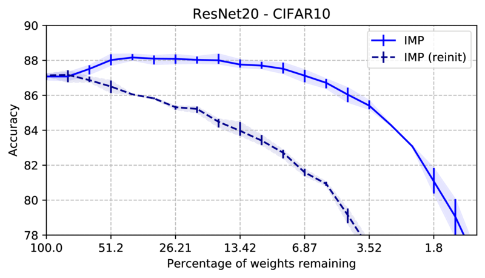
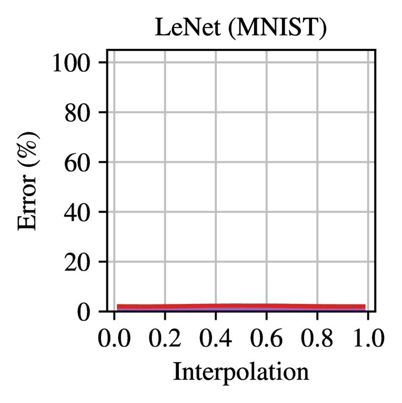
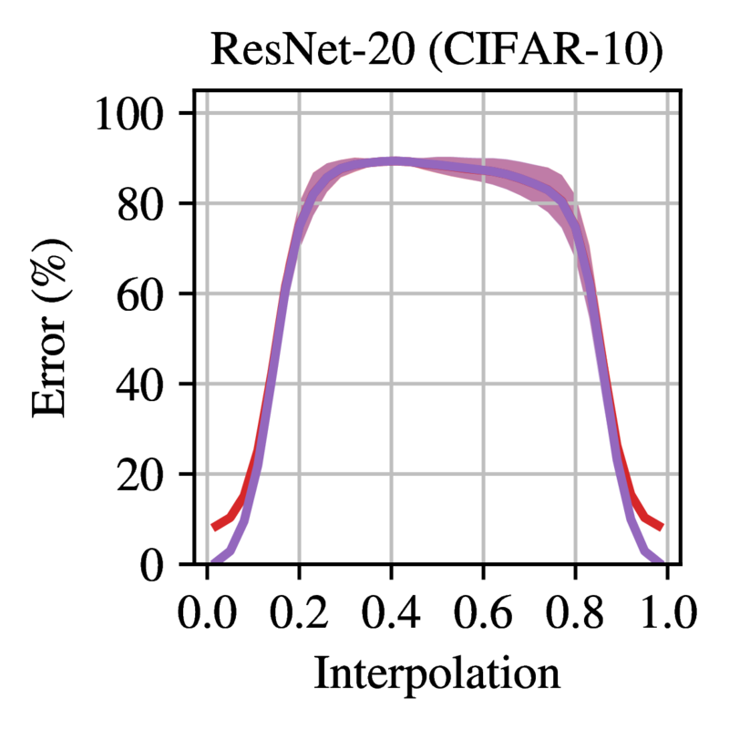
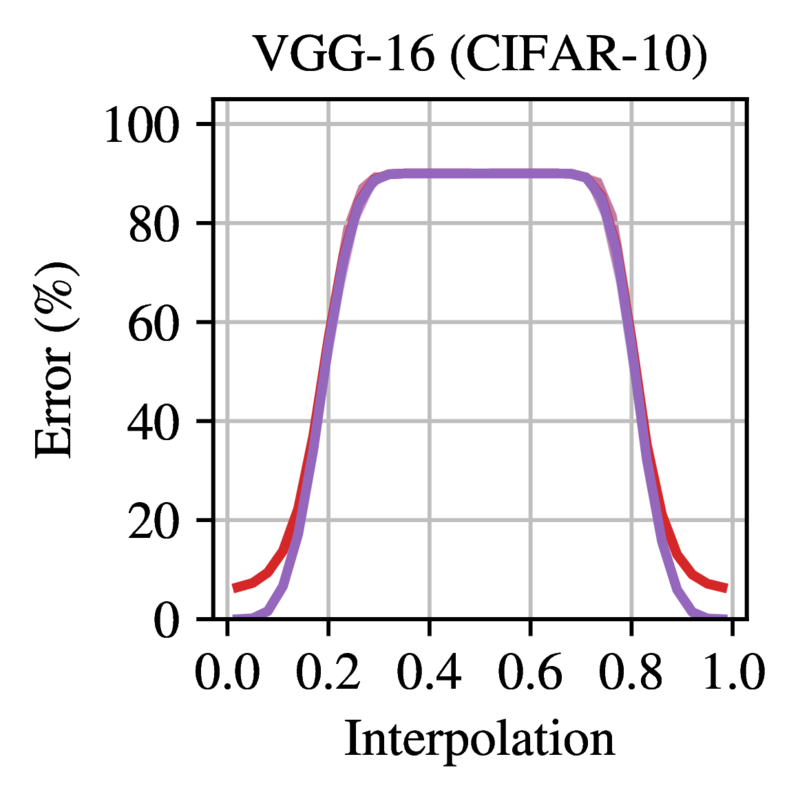
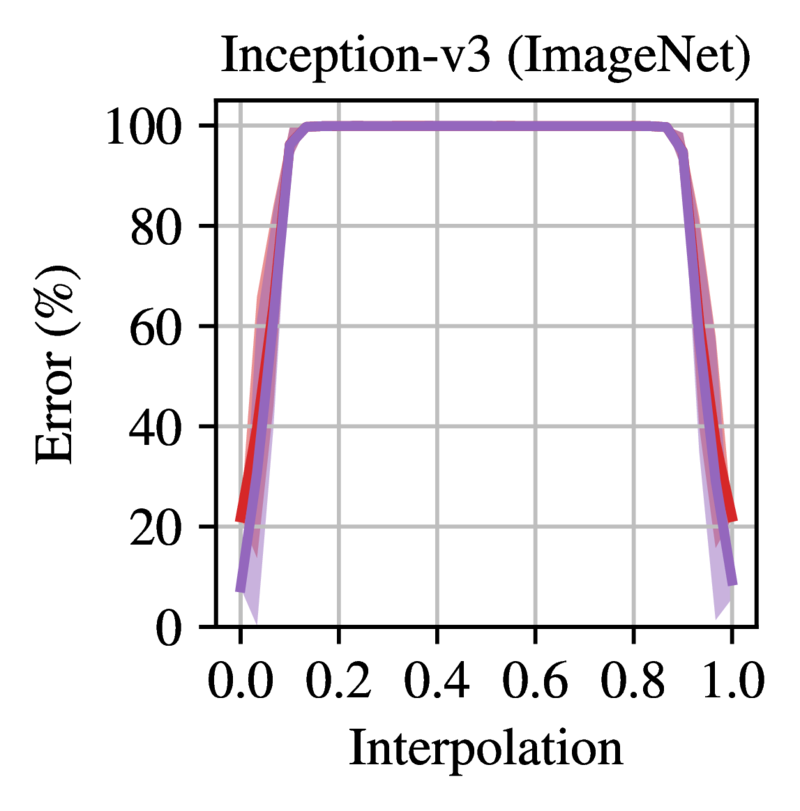
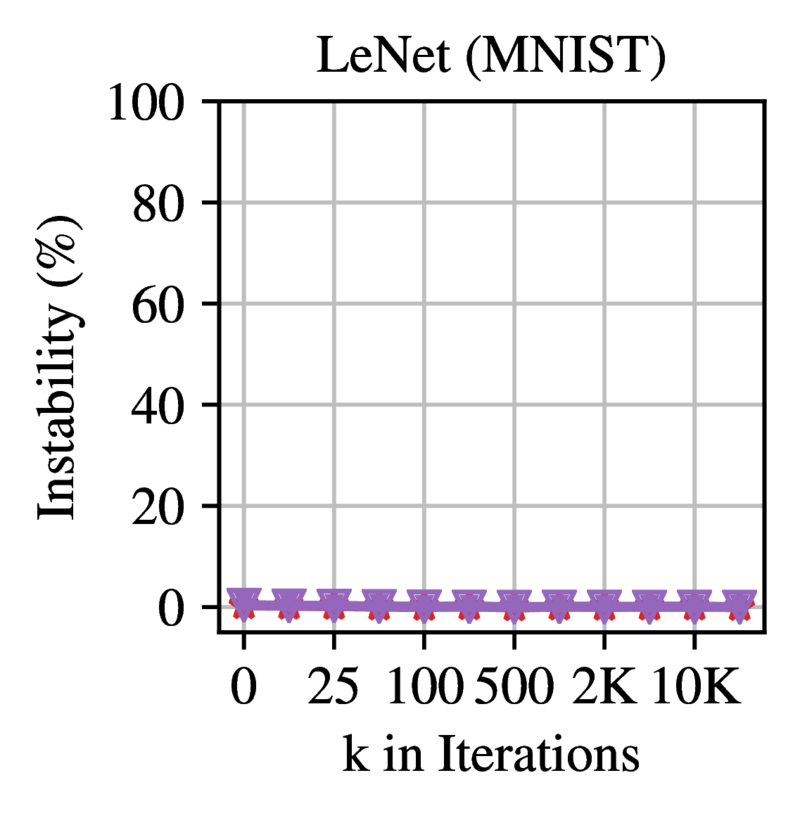
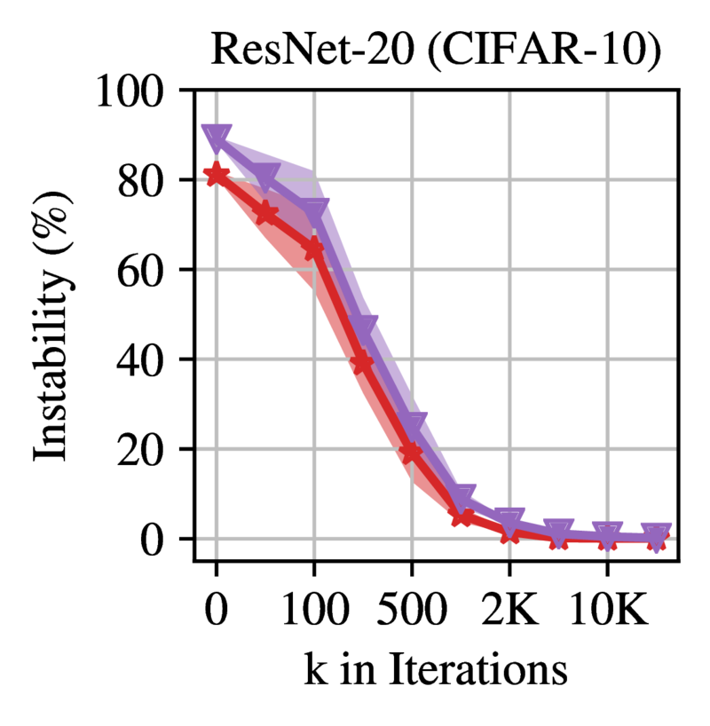

This post aims to give a short survey of the lottery ticket hypothesis (LTH), arguably the most fascinating topic in sparse neural networks. 
I'll assume basic familiarity with neural network pruning. If you're interested in learning more about neural network sparsity/pruning in general, I can think of no better resource than [this lecture](https://www.youtube.com/watch?v=H7-p3OWPpEI), where Torsten Hoefler gives an extensive introduction on the field, based on his 90-page [survey paper](https://arxiv.org/abs/2102.00554).

For other sources on the LTH, I can recommend:

- The original papers on the LTH by Frankle et al. ([1](https://arxiv.org/abs/1803.03635), [2](https://arxiv.org/abs/1912.05671)) are the standard references. They are excellently written and contain _very_ in-depth appendices.
- [A survey by R. Lange](https://roberttlange.github.io/posts/2020/06/lottery-ticket-hypothesis/), summarizing a lot of the core papers on the LTH.

## The lottery ticket hypothesis {#cha:1}

It was commonly believed that training a sparse neural network from scratch is
infeasible, until a landmark paper by [Frankle and Carbin (2018)](https://arxiv.org/abs/1803.03635) introduced
the lottery ticket hypothesis. Through extensive experimentation, the
authors show that a sparse network can train to the same accuracy as a
dense network, as long as a specific initialization is used. Based on
this observation, [Frankle and Carbin (2018)](https://arxiv.org/abs/1803.03635) formulate the following
hypothesis:

**The Lottery Ticket Hypothesis.** *A randomly-initialized, dense neural
network contains a subnetwork that is initialized such that --- when
trained in isolation --- it can match the test accuracy of the original
network after training for at most the same number of iterations.*

This implies that, if only the correct subnet can be determined, we can
train the sparse subnet instead of the dense network. A hopeful result,
although the method to find the subnet in question is very expensive. It
consists of an iterative pruning algorithm, where non-pruned weights are
reset back to their initialization before retraining. This is called
iterative magnitude pruning (IMP).

> **Algorithm 1**: Iterative magnitude pruning  
> Initialize the network $\mathcal{N}$ with random weights $\boldsymbol{\theta}_0$. 
> Create the mask $\boldsymbol{m}$ := $1^d$.  
> _while_ desired sparsity not achieved _do_  
> $\qquad$Train $\boldsymbol{\theta}_0 \odot \boldsymbol{m}$ for $i$ iterations, arriving at weights $\boldsymbol{\theta}_i \odot \boldsymbol{m}$.  
> $\qquad$Prune $p\%$ of the connections not masked by $\boldsymbol{m}$ with the smallest magnitude in $\boldsymbol{\theta}_i$. Set these connections to $0$ in the mask $\boldsymbol{m}$.

[Figure 1](#fig:basic_ResNet20_IMP) gives a basic demonstration of IMP. At
each pruning round, the trained weights are used to determine the new
sparser mask, while the remaining weights always start from the same
initialization. As a comparison, using the exact same structure with a
new initialization (usually called a reinitialization, or reinit) reaches
significantly lower performance. This is the novel part of IMP compared
to prior sparse training attempts; the weights need to be the same as
used when pruning.

<figure id="fig:basic_ResNet20_IMP">
	

	<figcaption> <i>Figure 1:</i> Basic example of the lottery ticket hypothesis on a residual network.
	A first experiment performs iterative magnitude pruning. Each round the
	network is trained, after which the 20% smallest weights are removed and
	the remaining weights are reset to the initialization. In a second
	experiment we train the same network structures, but with a new
	reinitialization instead of the original initialization. Experiments on
	CIFAR-10 with ResNet20. Average of 3 runs with different seeds; error
	bars indicate maximum and minimum
	values.</figcaption>
</figure>

The lottery ticket hypothesis also holds to some extent using one-shot
pruning, but [Frankle and Carbin (2018)](https://arxiv.org/abs/1803.03635) show that the strongest results are
achieved when iteratively pruning and retraining with an exponentially
decaying sparsity schedule. In practice, pruning $20\%$ per round is the
usual compromise between accuracy and speed. This means that IMP is an
exceedingly slow algorithm to prune a network; achieving $99\%$ sparsity
requires fully training the model 20 times (as $0.8^{20} \approx 0.01$).
This is further exacerbated by the fact that IMP is not parallelizable.

The LTH sparked many follow-up questions. Why is the initialization so
important combined with the structure. What are the properties of these
lottery tickets? Does it hold in all cases? Are lottery tickets specific
to a certain dataset or optimizer?

In the original paper, [Frankle and Carbin (2018)](https://arxiv.org/abs/1803.03635) conjecture (but do not
prove) that SGD seeks out a small subnet (the lottery ticket) during
training and optimizes this. IMP finds these small subnets and cuts away
all the superfluous parts of the model, which explains why very sparse
networks can still rival the dense performance. According to this
interpretation, over-parameterized networks are easier to train because
they contain more subnets, and hence have more possible winning tickets
at initialization.

## Linear mode connectivity

To find lottery tickets in medium-sized networks [Frankle and Carbin (2018)](https://arxiv.org/abs/1803.03635)
need to use warm-up and a small learning rate. [Liu et al. (2018)](https://arxiv.org/abs/1810.05270)
and [Gale et al. (2019)](https://arxiv.org/abs/1902.09574) show that lottery tickets could not be found in
large-scale networks such as ResNet50 on ImageNet, further calling the
generality of the LTH into question. This prompted
[Frankle et al. (2020)](https://arxiv.org/abs/1912.05671) to devise a refinement to the lottery ticket
hypothesis, relying upon the concept of mode connectivity.

Mode connectivity is introduced to study the (in)stability of stochastic
training. Neural network optimization introduces noise into training
through the random ordering of batches and possibly also via data
augmentations (e.g. random flips of images). By training the network
twice from the same starting point with different noise, one can
determine if the resulting optima are connected as a proxy for
stability.

Two networks are called mode connected if there exists a path between
them in weight space that does not increase the error. Linear mode
connectivity requires the path between the modes to be linear.

More formally let $\mathcal{E}(\boldsymbol{\theta})$ be the error of the
network with weights $\boldsymbol{\theta}$. [Frankle et al. (2020)](https://arxiv.org/abs/1912.05671)
define the linearly interpolated error between $\boldsymbol{\theta}_1$
and $\boldsymbol{\theta}_2$ as
$\mathcal{E}_\alpha (\boldsymbol{\theta}_1, \boldsymbol{\theta}_2) = \mathcal{E}(\alpha \cdot \boldsymbol{\theta}_1 + (1-\alpha) \cdot \boldsymbol{\theta}_2)$,
with $\alpha \in [0, 1]$. The linear interpolation instability (LII) is
the highest loss increase on this path:

$$LII(\boldsymbol{\theta}_1, \boldsymbol{\theta}_2) = \sup_\alpha \, \mathcal{E}_\alpha (\boldsymbol{\theta}_1, \boldsymbol{\theta}_2) - \frac {\mathcal{E}(\boldsymbol{\theta}_1) + \mathcal{E}(\boldsymbol{\theta}_2)} 2$$

The LII is used to check the stability of networks towards SGD noise.
When training a network twice using a different data ordering, a network
is said to be stable to SGD noise when these two networks after training
have a LII close to zero. In practice, the LII will rarely be exactly
zero, so a small threshold such as 2% can be used as a measure for
empirical stability.

[Frankle et al. (2020)](https://arxiv.org/abs/1912.05671) show that very small networks such as LeNet are
already stable at initialization, while larger networks become stable in
an early phase during training.
[Figure 2](#fig:full_instability_at_init) shows the error on the linear
path between two dense networks trained from the same initialization
with different SGD noise. All models except LeNet are completely
unstable at initialization, achieving random error between the two
modes. 
[Figure 3](#fig:full_instability_later) shows how the stability evolves
of dense models during training. The LII becomes close to zero after a
short period in early training.

<figure id="fig:full_instability_at_init">
	

		
		
		
		
		
	

	<figcaption> 
	<i>Figure 2:</i> Error on the linear path between networks trained from the same initialization with different SGD noise. Trained networks are at 0.0 and 1.0. Each line is the mean and standard deviation across three initializations and three data orders (nine samples in total). Reprinted from <a href="https://arxiv.org/abs/1912.05671">Frankle et al. (2020)</a>.
	</figcaption>
</figure>

<figure id="fig:full_instability_later">
	

		
		
		
		
		
	

	<figcaption> 
	<i>Figure 3:</i> Linear interpolation instability when starting from step k. Each line is the mean and standard deviation across three initializations and three data orders (nine samples in total). Reprinted from <a href="https://arxiv.org/abs/1912.05671">Frankle et al. (2020)</a>.
	</figcaption>
</figure>

[Frankle et al. (2020)](https://arxiv.org/abs/1912.05671) connect this discussion on stability with the
LTH, by showing through extensive experiments that the hypothesis only
applies when resetting to a stable state. So instead of resetting
entirely to initialization each round, they rewind to an early epoch
where the training has become stable. This revised version of the LTH is
also called the stabilized lottery ticket hypothesis.

Although they originally focussed on computer vision tasks, subsequent
works have since shown that the stabilized LTH holds on a very wide
range of models and tasks, such as BERT [(Chen et al, 2020)](https://arxiv.org/abs/2007.12223),
self-supervised computer vision tasks [(Chen et al, 2021)](https://arxiv.org/abs/2012.06908), adversarial
training [(Li et al, 2020)](https://arxiv.org/abs/2003.05733), LSTM's and reinforcement learning
[(Yu et al, 2020)](https://arxiv.org/abs/1906.02768).

## Pruning as training and the supermask

The reliance of the lottery tickets on the original initialization leads
to questions on the nature of these initializations.
[Frankle and Carbin (2018)](https://arxiv.org/abs/1803.03635) hypothesize that lottery tickets encode useful
inductive biases for the problem and the optimizer. However,
[Zhou et al. (2019)](https://arxiv.org/abs/1905.01067) find that lottery tickets can already
exhibit non-trivial accuracy without training, indicating that they
contain a stronger prior than what [Frankle and Carbin (2018)](https://arxiv.org/abs/1803.03635) implied.

[Zhou et al. (2019)](https://arxiv.org/abs/1905.01067) continue by designing a training method that
does not update weights, but only removes them. Given the huge number of
parameters in a dense network, and that a network has in the order of
$2^{|\boldsymbol{\theta}|}$ subnetworks, the authors propose that there
exists a performant subnet hidden in every randomly-initialized network.
[Ramanujan et al. (2020)](https://arxiv.org/abs/1911.13299) improve on this algorithm and show that even for
more challenging tasks such as ImageNet, they can find subnets with
fairly competitive accuracies. These performant subnets of random
networks are called supermasks. Based on this empirical evidence,
[Ramanujan et al. (2020)](https://arxiv.org/abs/1911.13299) state a stronger version of the LTH:

**The Strong Lottery Ticket Hypothesis.** *A randomly-initialized, dense
neural network $\mathcal{N}_1$ contains a subnetwork $\mathcal{N}_2$
that is initialized such that --- without training --- it can match the
test accuracy of $\mathcal{N}_1$ after training.*

The supermask methods show that pruning can be regarded as a method of
training. Pruning simply constrains the hypothesis space to the
axis-parallel projections of the full network, which can still be vast
as long as the network is sufficiently over-parameterized. The work of
[Malach et al. (2020)](https://arxiv.org/abs/2002.00585) gives a theoretical foundation to this
observation, by proving a restricted version of the strong LTH. They
prove that any dense ReLU network of depth $l$, can be approximated with
an arbitrarly high probability, by a subnet of a random $2l$-layer
network with sufficient width. Contrary to the proposition of the strong
LTH in [Ramanujan et al. (2020)](https://arxiv.org/abs/1911.13299), the proof requires polynomial
over-parametrization of the random network width, compared to the target
network, limiting the practical implications. [Orseau et al. (2020)](https://arxiv.org/abs/2006.12156)
improve this to a logarithmic bound, and removed the double depth
requirement.

Though pruning random initialized networks is not necessarily useful in
practice, it reshapes our understanding of pruning. Pruning is not only
a compression method but also expressive enough to be a training method.
This indicates that IMP might encode much bigger priors in lottery
tickets then the IMP algorithm would reveal at first glance. This raises
the concern that a lottery ticket might already contain all information
of the solution. In the next section, we discuss the transferability of
lottery tickets, to investigate how specifically these are tailored to
the task or optimization process.

## Transferability of lottery tickets

Finding lottery tickets using IMP can be exceedingly expensive. Hence a
natural question is whether a ticket transfers to other environments.
Can a lottery ticket found using a certain optimizer also train to
commensurate accuracy using another optimizer? And do they transfer
across datasets, or even tasks?

[Morcos et al. (2019)](https://arxiv.org/abs/1906.02773) investigate precisely these questions on common vision
tasks. They find that lottery tickets transfer fairly well across
optimizers and datasets. Furthermore, winning tickets found on larger
datasets (e.g. ImageNet or Places365) perform consistently better on
small vision tasks (e.g. CIFAR10 or FashionMNIST), compared to the
tickets generated on these tasks themselves.
[Sabatelli et al. (2020)](https://arxiv.org/abs/2005.05232) also evaluate transferability on more
diverse vision tasks with comparable results.

[Chen et al. (2020)](https://arxiv.org/abs/2007.12223) consider lottery ticket transferability in NLP
settings. There is already an established practice in NLP to pretrain
large language models such as BERT. The large upfront cost is amortized
by transfer learning to a variety of downstream tasks.
[Chen et al. (2020)](https://arxiv.org/abs/2007.12223) propose to use IMP in a similar fashion: the costly
procedure of finding a ticket is performed once on a masked language
modeling task, after which the ticket can be trained on a downstream
task. They empirically show that BERT has universal lottery tickets at
70% sparsity, meaning they can transfer to tasks from GLUE and SQUAD
while maintaining accuracy. In contrast, tickets found on downstream
tasks did not transfer to most other tasks.

These results indicate that tickets found by IMP are reasonably general;
structural transfer learning gives similar results compared to the
established weight-based form of transfer learning.

